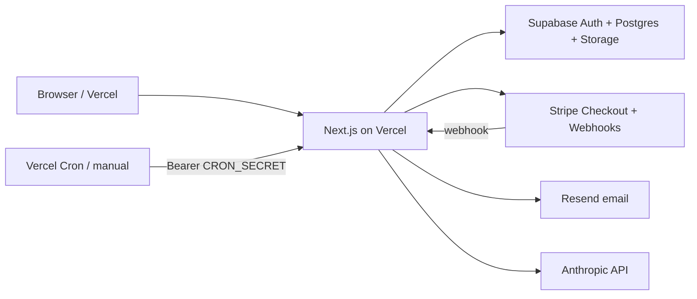

# Integrations and secrets

Where each external system connects, which env vars it uses, and what to configure outside the repo.

## Architecture (data flow)

Session auth is **Supabase Auth** (HTTP-only cookies via `@supabase/ssr`). Business data is **Postgres** with RLS; server actions often use the **service role** to bypass RLS for trusted writes.

---

## Environment variables

Template: [`.env.example`](../../.env.example) at repo root.

### Public (embedded in client bundle)

| Variable | Service | Used in |
| --- | --- | --- |
| `NEXT_PUBLIC_SUPABASE_URL` | Supabase | `lib/db/client.ts`, middleware |
| `NEXT_PUBLIC_SUPABASE_ANON_KEY` | Supabase | Browser + server anon client |
| `NEXT_PUBLIC_APP_URL` | Your app | Auth email redirects, Stripe return URLs, notification links |
| `NEXT_PUBLIC_STRIPE_PUBLISHABLE_KEY` | Stripe | Client checkout (if used on client) |

**Vercel production:** set `NEXT_PUBLIC_APP_URL` to the deployed URL, e.g. `https://121ai-v8kw-lendloop2025s-projects.vercel.app` (no trailing slash).

### Server-only

| Variable | Service | Used in |
| --- | --- | --- |
| `SUPABASE_SERVICE_ROLE_KEY` | Supabase | `createService()` — user rows, wallet, admin, audits |
| `STRIPE_SECRET_KEY` | Stripe | `app/actions/wallet.ts`, webhooks |
| `STRIPE_WEBHOOK_SECRET` | Stripe | `app/api/webhooks/stripe/route.ts` |
| `RESEND_API_KEY` | Resend | `lib/email/client.ts` |
| `RESEND_FROM_EMAIL` | Resend | Sender address (domain must be verified in Resend) |
| `SESSION_SECRET` | App | Encrypts TOTP secrets (`lib/auth/totp.ts`) |
| `ANTHROPIC_API_KEY` | Anthropic | Loan agreement narrative (`lib/llm/agreement.ts`) |
| `CRON_SECRET` | App | `/api/cron/*` routes |
| `NCI_EMAIL_DOMAINS` | App | `lib/auth/domain-allowlist.ts` — default `student.ncirl.ie,ncirl.ie` |
| `ADMIN_EMAIL_ALLOWLIST` | App | Who can be promoted to admin (see admin actions) |
| `SENTRY_DSN` | Sentry | Optional error monitoring (`@sentry/nextjs`) |

`GEMINI_API_KEY` appears in older docs; the current agreement generator uses **Anthropic**, not Gemini.

---

## Where to configure each service

### Vercel (hosting)

- **Project:** Linked to `lendloop2025/citiupstart` (or team fork).
- **Production URL:** [https://121ai-v8kw-lendloop2025s-projects.vercel.app/](https://121ai-v8kw-lendloop2025s-projects.vercel.app/)
- **Settings → Environment Variables:** All vars above for Production (and Preview if needed).
- **Build:** `npm run build` (default for Next.js).
- **Cron (if enabled):** Point jobs at `/api/cron/repayments` and `/api/cron/expire-requests` with `Authorization: Bearer <CRON_SECRET>`.

Teammates with access can run `vercel env pull .env.local` to sync secrets locally.

### Supabase

| Area | What to set |
| --- | --- |
| **Project URL + anon key** | → `NEXT_PUBLIC_*` |
| **service_role key** | → `SUPABASE_SERVICE_ROLE_KEY` (never expose to client) |
| **Authentication → URL configuration** | Add `http://localhost:3000/**` and `https://121ai-v8kw-lendloop2025s-projects.vercel.app/**` to redirect allow list |
| **Authentication → Email** | Sign-up verification links; confirm templates match `NEXT_PUBLIC_APP_URL` |
| **SQL migrations** | Run files in `supabase/migrations/` |
| **Storage** | Buckets for KYC docs and agreement PDFs (see `002_rls.sql`) |
| **Realtime** | Optional on `notifications` for inbox |

Auth users live in `auth.users`; app profile in `public.users` with **same UUID**.

### Stripe

| Area | What to set |
| --- | --- |
| **API keys** | Test vs live → `STRIPE_SECRET_KEY`, `NEXT_PUBLIC_STRIPE_PUBLISHABLE_KEY` |
| **Webhooks** | Endpoint: `{NEXT_PUBLIC_APP_URL}/api/webhooks/stripe` |
| **Events** | At minimum `checkout.session.completed` (see `app/api/webhooks/stripe/route.ts`) |
| **Signing secret** | → `STRIPE_WEBHOOK_SECRET` (Dashboard secret for prod; CLI `whsec_` for local) |
| **Local dev** | `npm run stripe:listen` forwards to port 3000 |

Money is modeled in **platform wallets** (cents in Postgres), not full Stripe Connect in the current MLP.

### Resend

| Area | What to set |
| --- | --- |
| **API key** | → `RESEND_API_KEY` |
| **Domain** | Verify sending domain; → `RESEND_FROM_EMAIL` |
| **Templates** | React Email components in `emails/`; sent via `lib/notifications/send.ts` |

Without Resend, core flows work; users miss offer/repayment emails.

### Anthropic

| Area | What to set |
| --- | --- |
| **API key** | → `ANTHROPIC_API_KEY` |
| **Usage** | Generates JSON narrative for loan PDFs after offer acceptance |

If missing, agreement generation may fail when signing loans.

### Sentry (optional)

Set `SENTRY_DSN` in Vercel for production error tracking.

---

## In-repo integration map

| Path | Integration |
| --- | --- |
| `proxy.ts` | Session refresh + route guard (Next 16 middleware pattern) |
| `lib/auth/middleware.ts` | Public vs protected routes; admin gate |
| `lib/db/client.ts` | Supabase server/browser/service clients |
| `app/actions/auth.ts` | Supabase `signUp` / `signInWithPassword` |
| `app/actions/wallet.ts` | Stripe Checkout sessions |
| `app/api/webhooks/stripe/route.ts` | Credit wallet on successful deposit |
| `app/actions/repayment.ts` | Wallet debits/credits for repayments |
| `lib/pdf/agreement.tsx` + `lib/llm/agreement.ts` | PDF + Claude narrative |
| `lib/notifications/send.ts` | In-app + Resend email |
| `lib/scoring/*.ts` | Rule-based 0–100 score (not the Python ML model) |

---

## Security notes

- Never commit `.env.local` or service role keys.
- `app/api/debug-session/route.ts` is for debugging — restrict or remove in production if exposed.
- RLS protects member data; **service role bypasses RLS** — only use in server actions you trust.
- TOTP secrets are encrypted with `SESSION_SECRET`; rotating it invalidates stored 2FA secrets.
