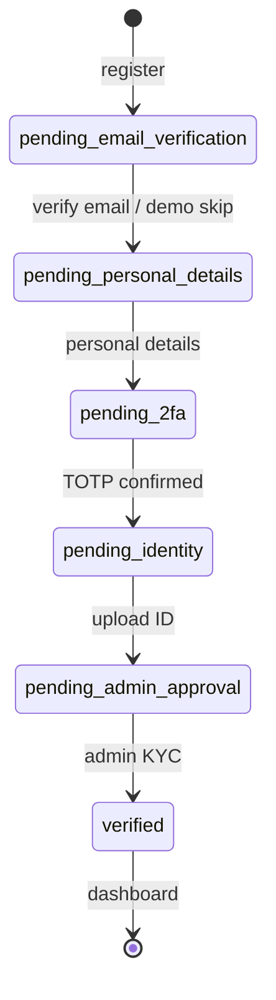

# Project overview

A single map of what 121.ai is, how this repo is organized, and how the deployed demo fits together.

## Product in one sentence

**121.ai** (by **LendLoop**) is a **closed-community P2P lending platform** for NCI: verified students/staff lend to and borrow from each other inside one tenant (`communities.slug = 'nci'`), with wallets, credit scores, and audit logs — not a public marketplace.

Pilot positioning: [live landing](https://121ai-v8kw-lendloop2025s-projects.vercel.app/) — peer-to-peer lending for NCI, euro-denominated, Stripe custody messaging on the marketing site.

---

## Two codebases in one repo (important)

| Path | Stack | Status |
| --- | --- | --- |
| **Repo root** (`app/`, `lib/`, `package.json`) | Next.js 16 + Supabase + Stripe | **Production** — what Vercel deploys |
| **`citiupstart/`** | Flask + MySQL + Jinja | **Prototype / reference** from early sprints |
| **`features/`** | Python sklearn | **Offline ML** — confidence score; not wired into Next.js UI yet |

The root `README.md` still mentions Flask/MySQL; treat it as historical. Trust this `developer-guide` and `implementation.md` for the live stack.

---

## Demo account on Vercel

| Field | Value |
| --- | --- |
| **URL** | [https://121ai-v8kw-lendloop2025s-projects.vercel.app/](https://121ai-v8kw-lendloop2025s-projects.vercel.app/) |
| **Email** | `x24197432@student.ncirl.ie` |
| **Auth** | Supabase **email + password** at `/login` |
| **2FA (TOTP)** | Onboarding uses a **6-digit authenticator app code** (Google Authenticator, 1Password, etc.) — this is what we mean by “OTP” in this project: **TOTP**, not SMS |

**Seeded profile** (`supabase/migrations/004_seed_demo.sql`):

- `public.users` UUID: `d81f3a89-70b8-4dd1-b713-67abedf09241`
- Status: `verified`, role: `member`, name Umer Khan, MSc Cloud Computing
- Credit score: **72** (standard tier, up to €1,000 per score table)
- `totp_enabled: true` in seed — you still need the **password** from whoever created the Supabase Auth user

**If login fails:** reset password in Supabase Dashboard → Authentication → Users, or ask Smruti (admin seed: `x24269522@student.ncirl.ie`) for shared demo credentials.

**Admin demo lender** (pre-funded €500): `x24269522@student.ncirl.ie` — `role: admin` in seed.

---

## Auth and onboarding flow



| Step | Route | What happens |
| --- | --- | --- |
| Register | `/register` | NCI email only; creates `auth.users` + `public.users` |
| Verify email | `/verify-email` | Link from Supabase email; demo may skip |
| Personal | `/onboarding/personal-details` | Address, program, mobile |
| 2FA | `/onboarding/two-factor` | QR → **6-digit TOTP** |
| Identity | `/onboarding/identity` | Document upload |
| Wait | `/onboarding/complete` | Until admin approves |
| App | `/dashboard` | Requires `users.status = 'verified'` |

`proxy.ts` runs on almost every request: refreshes Supabase session cookies and redirects unauthenticated users to `/login`.

---

## Main user routes (after verified)

| Route | Role | Purpose |
| --- | --- | --- |
| `/dashboard` | All | Wallet summary, open requests, notifications |
| `/borrow` | Borrower | Create loan requests |
| `/borrow/[id]` | Borrower | View offers, counter-offers, accept |
| `/invest` | Lender | Browse community loan requests |
| `/invest/[id]` | Lender | Make an offer |
| `/deposit` | Lender | Stripe Checkout → wallet |
| `/loans`, `/loans/[id]` | Both | Active loans, repay, early payoff |
| `/agreements/[id]/sign` | Both | E-sign generated agreement PDF |
| `/transactions` | All | Ledger history |
| `/admin/*` | Admin | KYC queue, users, audit log |

Marketing content is on `/` (landing). Auth pages use `(auth)` layout; app chrome uses `(app)` layout.

---

## Money and loans (mental model)

1. **Wallet** — balance in **cents** in Postgres (`wallets` + ledger functions in `003_wallet_functions.sql`).
2. **Deposit** — Stripe Checkout → webhook → `credit_wallet_atomic`.
3. **Loan request** — borrower posts amount, term, max APR, purpose.
4. **Offer** — lender commits wallet funds at an APR.
5. **Accept** — creates `loan`, generates agreement (Claude + `@react-pdf/renderer`), both sign.
6. **Repayment** — scheduled; cron processes due rows; score recomputes on payment (`lib/scoring/recompute.ts`).

Subtle rules from `flow.md`:

- Max **2 active loans** per borrower.
- Loan requests **expire after 14 days** if unfunded (`/api/cron/expire-requests`).
- Score tiers cap principal (e.g. 65–79 → €1,000).
- All amounts are **EUR**; storage is integer cents.

---

## Scoring: two systems

| System | Location | Used by UI? |
| --- | --- | --- |
| **Rule-based credit score** (0–100, five components) | `lib/scoring/score.ts`, `recompute.ts` | **Yes** — dashboards, limits |
| **ML confidence model** | `features/confidence_score.py` | **No** (train offline; future lender signal) |

Landing page “127 members / €48.2K funded” is **marketing copy** on the static homepage, not live analytics unless wired later.

---

## Key folders

```
Project_claude/
├── app/                    # Next.js App Router pages + server actions
├── components/ui/          # Shared UI
├── lib/                    # Auth, DB, finance, scoring, PDF, email
├── emails/                 # React Email templates
├── supabase/migrations/    # Source of truth for schema
├── docs/developer-guide/   # This guide
├── features/               # Python ML (optional)
├── citiupstart/            # Legacy Flask app
├── design/ flow.md implementation.md system_design.md  # Specs
└── project_context/        # Business context for humans/LLMs
```

---

## Subtle gotchas (save you hours)

1. **`public.users.id` must equal `auth.users.id`** — registration inserts both; manual SQL seed without Auth user breaks login.
2. **Service role in server actions** — normal for inserts; RLS alone is not enough for onboarding writes.
3. **`NEXT_PUBLIC_APP_URL` must match where you run** — wrong value breaks email verification links and Stripe redirects.
4. **Stripe webhook secret differs** — CLI `whsec_` (local) vs Dashboard endpoint secret (Vercel); mixing them causes silent deposit failures.
5. **`proxy.ts` is the middleware** — Next 16 renamed the file from `middleware.ts`; session logic is in `lib/auth/middleware.ts`.
6. **Verified gate** — `requireVerified()` sends incomplete users to `/onboarding/complete`; you cannot borrow/lend until `status = 'verified'`.
7. **Community tenancy** — almost every row has `community_id`; NCI is one row in `communities`; multi-school is a data row, not a fork.
8. **Agreement signing needs Anthropic** — budget an API key for end-to-end loan tests.
9. **README at root is outdated** on stack — use `package.json` name `"121ai"` and this guide instead.
10. **Branch `umer_dev`** may contain docs/market work merged with `main` app code — always run from root Next app after pull.

---

## Related docs

| File | Content |
| --- | --- |
| `flow.md` | End-to-end platform flows (auth, offers, repayments) |
| `implementation.md` | Full build spec + deployment checklist |
| `system_design.md` | Deeper architecture |
| `project_context/lendloop_project_context.md` | Business model, team, scoring philosophy |
| `features/README.md` | ML pipeline |

---

## Team context

See root `README.md` for roles. **Vercel deploy** is maintained by the cloud/web teammates; **Supabase/Stripe/Resend** keys live in Vercel env — request access rather than creating duplicate projects unless building a personal sandbox.
